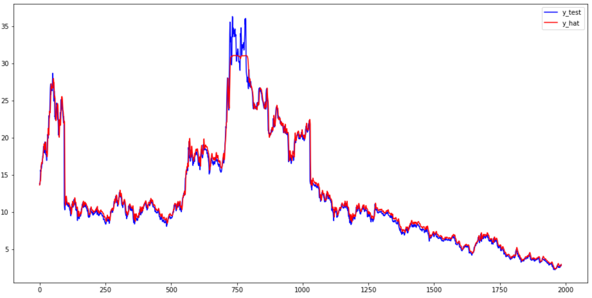

# Stock-Forecasting

>浙江大学《机器学习及其应用》课程作业，A 股预测
>
>项目来源于：<https://mo.zju.edu.cn/workspace/5fcfa8ad6a17c926c110ed60?type=app&tab=2>（只有我自己的号才能上）

项目介绍及说明查看 `main.ipynb`

## 1 LSTM

这里用了一个简单的 LSTM 网络来训练

```python
class LSTM(nn.Module):
    def __init__(self, num_hiddens, num_outputs):
        super(LSTM, self).__init__()
        self.lstm = nn.LSTM(
            input_size=1,
            hidden_size=num_hiddens,
            num_layers=1,
            batch_first=True
        )
        self.fc = nn.Linear(num_hiddens, num_outputs)

    def forward(self, x):
        x = x.view(x.shape[0], -1, 1)
        r_out, (h_n, h_c) = self.lstm(x, None)
        out = self.fc(r_out[:, -1, :])  # 只需要最后一个的output
        return out
```

运行 `train.py` 进行训练，部分输出如下

```text
torch.Size([1984, 14]) torch.Size([1984, 1])
epoch 10, train loss 78.426200, train mae 5.978433, mape 0.466861, valid mae 5.978433, mape 0.466861, time 0.46 sec
epoch 20, train loss 51.656009, train mae 5.470824, mape 0.612202, valid mae 5.470824, mape 0.612202, time 0.43 sec
...
epoch 190, train loss 0.876133, train mae 0.456156, mape 0.035377, valid mae 0.456156, mape 0.035377, time 0.45 sec
epoch 200, train loss 0.833096, train mae 0.449250, mape 0.035143, valid mae 0.449250, mape 0.035143, time 0.45 sec
```

最后的预测效果：



其他指标等可查看 `lstm.ipynb`


## 2 加上数据归一化

用 `MinMaxScaler` 进行归一化后，虽然指标有一定的下降，但是在测试的时候效果更好了。

运行 `train_scaler.py` 进行训练，部分输出如下

```text
(1984, 14) (1984,)
(1984, 14) (1984,)
torch.Size([1984, 14]) torch.Size([1984, 1])
epoch 10, train loss 0.000570, train mae 5.679749, mape 0.692404, valid mae 5.679749, mape 0.692404, time 0.45 sec
epoch 20, train loss 0.000466, train mae 5.188509, mape 0.622329, valid mae 5.188509, mape 0.622329, time 0.44 sec
...
epoch 190, train loss 0.000015, train mae 0.605080, mape 0.049801, valid mae 0.605080, mape 0.049801, time 0.44 sec
epoch 200, train loss 0.000014, train mae 0.569416, mape 0.045786, valid mae 0.569416, mape 0.045786, time 0.46 sec
```

